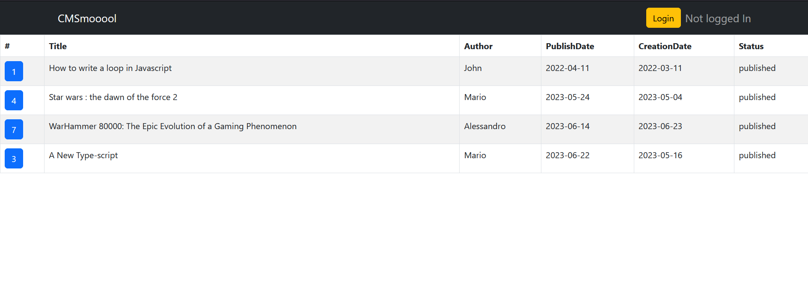
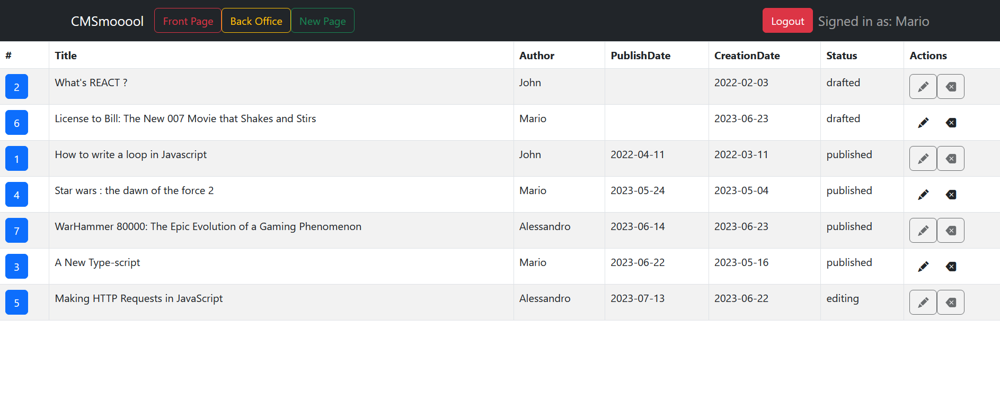
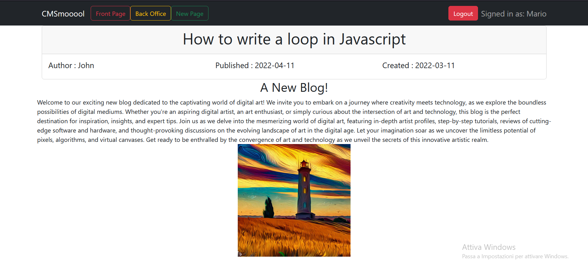
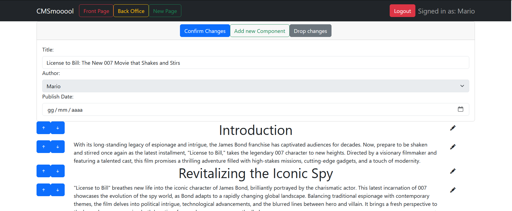

# Exam #1: "CMSmall"
## Student: s309234 CHIABODO ALESSANDRO 

## React Client Application Routes

- Route `/`: Pagina principale che mostra la lista completa delle pagine
- Route `/back/` : Pagina per soli utenti autenticati, mostra tutte le pagine anche non pubblicate
- Route `/pages/:pageID/` : Mostra il contenuto della singola pagina, per le pagine non pubblicate è necessario essere autenticati
- Route `/pages/:pageID/edit` : Permette di editare la pagina se autenticati
- Route `/pages/new/` : Permette di aggiungere una nuova pagina se autenticati
- Route `/login` : Pagina per effettuare il login

## API Server
### API Front Office
- GET `/api/front/pages`
  - Nessun parametro per la richiesta
  - Lista delle pagine pubblicate sul sito, senza i loro contenuti
- GET `/api/front/pages/<id>`
  - id della pagina richiesta
  - Dati della pagina e relativo contenuto (Se pubblicata)
- GET `/api/front/name`
  - Nessun parametro per la richiesta
  - Nome del sito web
### API Back Office (Necessitano login)
- GET `/api/pages`
  - Nessun parametro per la richiesta
  - Lista di tutte le pagine sul sito, senza i loro contenuti
- GET `/api/pages/<id>`
  - id della pagina richiesta
  - Dati della pagina e relativo contenuto
- GET `/api/users`
  - Nessun parametro per la richiesta
  - Lista di tutti gli utenti del sito
- GET `/api/users/<id>`
  - Nessun parametro per la richiesta
  - Ritorna i dati dell'utente richiesto
- GET `/api/images`
  - Nessun parametro per la richiesta
  - Ritorna la lista dei metadati di tutte le immagini disponibili
- POST `/api/pages`
  - Il body della richiesta deve contenere:
    titolo
    data di creazione
    autore
    data di pubblicazione (opzionale : null)
    lista dei contentBlocks, ciascuno con id, tipo, contenuto e ordine
  - pageId
- PUT `/api/pages/<idPage>`
  - Unico parametro id della pagina
    Il body della richiesta deve contenere:
    titolo
    data di creazione
    autore
    data di pubblicazione (opzionale : null)
    lista dei contentBlocks, ciascuno con id, tipo, contenuto e ordine
  - Numero di righe modificate
- PUT `/api/namesite`
  - Il body contiene il nome del sito
  - Il nome del sito se l'update è andato a buon fine
- PUT `/api/pages/<id>`
  - Unico parametro l'id della pagina da eliminare
  - Numero componenti eliminati
### API Sessione
- GET `/api/sessions/current`
- POST `/api/sessions`
- DELETE `/api/sessions/current`

## Database Tables

- Table `users` - (id, name , email , salt , hash , Role)
        Contiene tutte le informazioni sugli utenti
- Table `contentBlock` - (id, page , Type , Content , Position)
        Contiene i content blocks delle varie pagine
- Table `pages` - (id, title , creationDate , author , publishDate)
        Contiene i dati delle pagine del sito
- Table `site` - Contiene il nome del sito
- Table `images` - (id, name , path)
        Contiene i metadati per le immagini mostrate sul sito

## Main React Components

- `App` (in `App.js`): Componente principale dell'applicazione che si occupa principalmente della gestione degli stati e delle route
- `MainPage` (in `MainPage.js`): Componente utilizzato per il rendering delle sotto-pagine e per la gestione degli errori
- `FrontTable` (in `MainPage.js`): Componente utilizzato per scaricare le pagine e per mostrarne l'elenco su tabella nel Front Office
- `BackTable` (in `MainPage.js`): Componente utilizzato per scaricare le pagine e per mostrarne l'elenco su tabella  nel Back Office
- `PageRow` (in `MainPage.js`): Componente che lista le proprietà della singola pagina in una riga della tabella
- `LoginForm` (in `AuthComponent.js`): Componente per il login
- `PageContainer` (in `PageContainer.js`) : Gestisce visualizzazione e modifica delle singole pagine
- `EditComponent` (in `PageContainer.js`) : Visualizza un contentBlock e ne permette la modifica
- `ViewComponent` (in `PageContainer.js`) : Visualizza un singolo contentBlock
- `EditModal` (in `EditModal.js`) : Fornisce il modale per la modifica o la creazione di un nuovo contentBlock
- `MyNav` (in `MyNav.js`) : Componente per la navbar con logica per gestire login / logout e passaggio tra Front Office e Back Office

## Screenshot

### Front Office

### Back Office

### A page

### Editing a page

## Users Credentials

- mario.rossi@polito.it         - "password"  - Regular
- user.admin@polito.it          - "password"  - Admin
- luigi.pallini@polito.it       - "password"  - Regular
- alessandro.chiabodo@polito.it - "password"  - Regular

